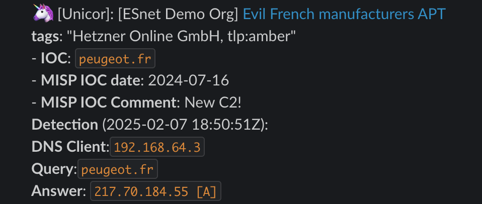

# Unicor

<picture>
  
</picture>


**Unicor is a generic correlation and alerting engine, matching MISP events against JSON input from a variety of sources.**

Sources include `dnstap` with [DNS-collector](https://github.com/dmachard/DNS-collector) or any JSON source in the [Unicor schema](#unicor-json-schema) and include Zeek, Netflow alerts and more.

Unicor does retro-searches too, it can go back to older data and attempt to match it again against more recently added MISP events.

Unicor is the successor of [pDNSSOC](https://github.com/safer-trust/pdnssoc-cli), and is proudly supported by [SAFER](https://safer-trust.org) members.

## Usage

```
Usage: unicor [OPTIONS] COMMAND [ARGS]...

Options:
  -c, --config FILE  Read option defaults from the specified yaml file
                     [default: /etc/unicor/config.yml]
  --help             Show this message and exit.

Commands:
  fetch-iocs                      Fetch IOCs from MISP, typically domains and IPs
  correlate                       Correlate input files and produce matches for potential alerts
  correlate --retro_disco_lookup  Reprocesses input in the list of newer MISP events
  alert                           Send alerts to pre-defined destinations like Slack
```

## Installation summary

A complete Unicor installation only requires:
  1. Access to a MISP instance (URL + API key are required)
  2. A source of data, for example:
  - `dnstap` files (typically rsync'ed via SSH) and a local [DNS-collector](https://github.com/dmachard/DNS-collector)
  - Any source (Zeek, etc.) producing files in the [Unicor JSON schema](#unicor-json-schema)
  4. A destination for alerts: Webhooks like Slack are highly recommended, or email (deprecated)

The installation guide will focus first on deploying and configuring Unicor, then provide configuration examples for different input sources.

An example `dnstap` alert in Slack:

<picture>
  
</picture>


## Installation guide

### 1. Installing Unicor

#### 1.1 Binary installation
The recommended installation path is to use a binary form of Unicor, produced by PyInstaller.

(It may be necessary to install dependencies and specifically reference PyMISP)
```
git clone https://github.com/safer-trust/unicor.git
cd unicor/src/
pyinstaller  --add-binary="/usr/local/lib/python3.9/dist-packages/pymisp:pymisp" -F  unicor.py
```
Then the binary will be readily available:
```
 ./dist/unicor 
Usage: unicor [OPTIONS] COMMAND [ARGS]...

Options:
  -c, --config FILE  Read option defaults from the specified yaml file
                     [default: /etc/unicor/config.yml]
  --help             Show this message and exit.

Commands:
  alert       Raise alerts for spotted incidents
  correlate   Correlate input files and output matches
  fetch-iocs  Fetch IOCs from intelligence sources
```
A ELF 64-bit dynamically linked version is also directly available in the [dist directory](https://github.com/safer-trust/unicor/tree/main/src/dist) of the repository.

Move the binary in one of the executable PATH, for example:

  ```sh
  sudo mv ./dist/unicor /usr/local/bin/
  ```
#### 1.2 Repo installation

This is not recommended and may result in a number of issues with Python dependencies, paths, and venv mishaps. 

```
git clone https://github.com/safer-trust/unicor.git
cd unicor/
python3 -m ./unicor
```

For compatibility with the rest of this guide, it is necessary to create a script executing `python3 -m ./unicor`, available in $PATH.
For example, a Bash or Python script in `/usr/local/bin/unicor`.

### 2. Configuring Unicor

#### 2.1 Filesystem preparation

Create the relevant user, files and directories, and assign permissions:

    ```sh
    sudo useradd --system --no-create-home --shell /usr/sbin/nologin unicor
    mkdir -p /var/unicor /var/dnscollector/alerts /var/unicor/queries /var/unicor/matches
    touch /var/unicor/alerts/matches.json /var/unicor/misp_ips.txt /var/unicor/misp_domains.txt /var/unicor/queries/queries.json /var/unicor/alerts_db.txt /var/unicor/matches/matches_domains.json /var/unicor/matches/matches_ips.json
    chown -R unicor:unicor /var/unicor/
    chmod -R u+rw /var/unicor/
    sudo mkdir /etc/unicor
    ```

#### 2.2 Configuration file & CRON

- Create the Unicor configuration file (`config.yml`) under `/etc/unicor/`, based on the [Unicor template]([https://github.com/safer-trust/pdnssoc-cli/blob/main/config/pdnssoccli.yml](https://github.com/safer-trust/unicor/blob/main/config/config.yml).

   ```sh
   curl -o /etc/unicor/config.yml https://raw.githubusercontent.com/safer-trust/pdnssoc-cli/refs/heads/main/config/pdnssoccli.yml
   chown -R unicor:unicor /etc/unicor
   ```

- Modify it to add you MISP URL + API, and configure a destination output for alerts. Webhooks are recommended.
  
  ```sh
  vi /etc/unicor/config.yml
  ```

- Test your configuration file
  ```sh
  # pip install yamllint
  # yamllint /etc/unicor/config.yml
  ```

- Test the Unicor commands
  ```sh
  # sudo -u unicor unicor fetch-iocs
  # sudo -u unicor unicor correlate
  # sudo -u unicor unicor alert
  ```

- Add a CRON to run Unicor on a schedule, for example in `/etc/crontab`:

  ```
  * * * * * unicor unicor fetch-iocs  >> /var/log/unicor-fetch-iocs.log 2>&1
  * * * * * unicor unicor correlate  /var/unicor/matches >> /var/log/unicor-correlate.log 2>&1 &&  pdnssoc-cli alert  /var/unicor/alerts/ >> /var/log/unicor-alert.log 2>&1
  ```

- Optional: Enable retro-searches

Unicor can reprocess and re-correlated JSON input as new MISP events are added.
  1. Create a dedicated directory to add JSON files, for example: `/var/unicor/archive/`
  2. Add another CRON to run retro-searches on a schedule, for example in `/etc/crontab`:

  ```
    * * * * * unicor ([ $(awk '{print $1}' /proc/loadavg) \< 0.5 ] && unicor correlate c /var/unicor/archive/) >> /var/log/unicor-retro.log  2>&1
  ```

The main use case here is `dnstap` data process with [DNS-collector](https://github.com/dmachard/DNS-collector), where a dedicated `pipelines`
to archive all DNS queries has previously been added as follows:
  ```
   - name: fileall
     logfile:
          file-path: /var/dnscollector/queries/queries.json
          mode: json
          flush-interval: 1
          # Tune the size and number of files used for retro searches here:
          max-size: 200
          max-files: 5
          chan-buffer-size: 65535
          postrotate-delete-success: true
  ```

Please refer to the [DNS-collector](https://github.com/dmachard/DNS-collector) configuration below for more information.


### 3. Adding supported sources

<a name="unicor-json-schema"></a>
#### 3.1 input Unicor JSON 

Any data following the Unicor JSON schema can be added as a source.

JSON files must be placed with a `.json` extension in the configured `input_dir` in `/etc/unicor/config.yml`.
- The default is `/var/dnscollector/matches/`
- An example input file could be `/var/dnscollector/matches/zeek-2025-02-14.json`
- The JSON files contain **one JSON object per line**, each representing a potential alert
- Each line **must follow** the Unicor JSON schema 

Unicor JSON schema, originally in ONE LINE, but made prettier below:
  ```
  {
   "ioc": "${domain or ip}",  // domain or IP address
   "type": "${type}", // Optional field expressing the type of IOC. Type can be "ip" or "domain"
   "timestamp-rfc3339ns": "${time}", 
   "detection": "${alert}", // Text or simple Markdown with the actual alert
   "uid": "${uid}", // Optional uid of the source event
   "url": "${url}", // Optional url of the source event
  }
  ```

#### 3.2 input Unicor JSON examples

In Zeek, `${alert}` could be: `"id.orig_h:id.orig_p -> id.resp_h:id.resp_p (seen.where)"`
Example:
  ```
  {
   "ioc": "evil.top",
   "timestamp-rfc3339ns": "2025-02-07T18:50:51.659830055Z",
   "detection": "*Connection: `188[.]184[.]21[.]197:3245` -> `123[.]345[.]123[.]456` (X509::IN_CERT)",
   "uid": "Cm8QYURGEZkdmwMFi",
  }
  ```
For netflows, a valid input could be:

  ```
  {
   "ioc": "123[.]345[.]123[.]456",
   "type": "ip",
   "timestamp-rfc3339ns": "2025-02-09T11:50:11.659830055Z",
   "detection": "*Connection: `188[.]184[.]21[.]197:3245` -> `123[.]345[.]123[.]456`\n*Bytes*: 4Kb sent, 1MB received",
   "url": "https://security-dashboard.uni.edu",
  }
  ```
#### 3.4 dnstap and [DNS-collector](https://github.com/dmachard/DNS-collector)

This is a primary use case for Unicor. 

To configure [DNS-collector](https://github.com/dmachard/DNS-collector) as a source for Unicor, follow [this detailed configuration](dns-collector-configuration.md).


